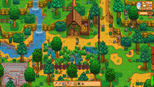
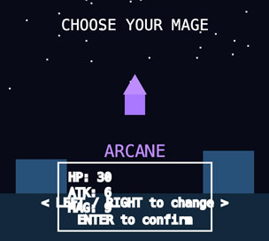

# Battle pixels
## Day 1

### About The Battle
You are a mage on the brink of the adventure of a lifetime. Your destiny is to become the greatest wizard of all time by seeking out and claiming the powers of the world’s most legendary sorcerers.

Your hunt begins in a realm where neither good nor evil will stand in your way—nothing will stop you from achieving your ultimate goal.

BECOME THE GRaATEST WIZZARD OF ALL TIME!

### Why do I want to make a game?

It encourages persistence in tackling complex problems and learning new concepts.
Beyond coding, the process cultivates a wide range of valuable, transferable skills, including:

* #### Problem-solving and critical thinking

* #### Creativity and design thinking

* #### Creating tangible, interactive outcomes

* #### Understanding and applying control structures

I also love games—especially those with rich storytelling and compelling RPG premises.

## Day 2
### My first step
My first step towards developing My wizard action RPG will be to research some games with similar structure.
Those games are the following:

|Pokémon Ranger: Guardian Signs|         |Rick and Morty: Pocket Mortys|         | Stardew Valley|

 
 
 These games are what inspired me to create this project. Ever since the first Harry Potter game came out—yes Harry potter Deathly Hallows part 1-I’ve wanted to make a wizard game of my own. I’ve always loved pixel games, and this felt like the perfect opportunity to create a story while putting my skills into practice.

(Now I undertand the struggle of game devs)

## Day 3
### Game Flow
At this stage, I took feedback from friends and professors into consideration to create a flow that helped me visualize the different stages of the game. This process clarified my priorities and established the game’s base structure.

 '

## Day 4
### First Draft

 
 